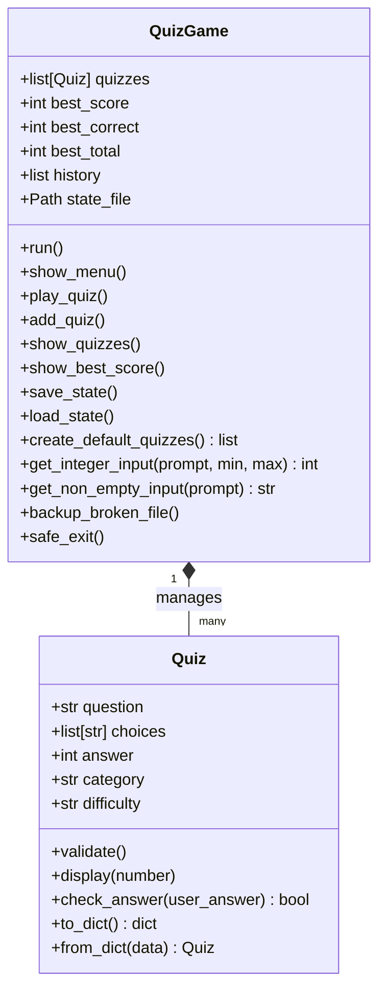

# 🐍 나만의 Python 콘솔 퀴즈 게임 (quiz-game)

Python 기초 문법, 객체지향 프로그래밍(OOP), JSON 파일 입출력, 예외 처리, 그리고 Git/GitHub 협업 워크플로우를 익히기 위해 개발된 터미널 기반 대화형 콘솔 퀴즈 게임 프로젝트입니다.

---

## 📌 1. 프로젝트 개요 및 개발 목적

* **프로젝트 명**: quiz-game (나만의 Python 퀴즈 게임)
* **개발 목표**:
  * Python 표준 라이브러리만을 활용한 객체지향 프로그래밍 학습
  * `json` 파일 입출력을 통한 영구적 데이터 상태 관리 및 복구 시스템 구축
  * 잘못된 사용자 입력 및 시스템 시그널(`Ctrl+C`, `EOFError`)에 안전한 터미널 퀴즈 응용프로그램 개발
  * Git 브랜치 전략(`feature/play-quiz` → `main`) 실습 및 협업 명령어 체득

---

## 🎯 2. 퀴즈 주제 및 선정 이유

* **퀴즈 주제**: **Python 기초, Git 버전 관리, JSON 데이터 직렬화**
* **선정 이유**:
  * Python 프로그래밍을 처음 시작하는 입문자가 반드시 익혀야 하는 핵심 지식을 검증하기 위함입니다.
  * 개발자로서 필수적인 버전 관리 시스템(Git)과 데이터 교환 표준(JSON)의 개념을 퀴즈를 풀며 재미있게 점검할 수 있도록 구성하였습니다.

---

## ✨ 3. 주요 기능

1. **퀴즈 풀기 (Play Quiz)**
   * 저장된 문제 중 원하는 개수만큼 선택하여 풀기
   * 문제 순서 랜덤 섞기 (`random.shuffle`)
   * 각 문제별 4지 선다 선택지 출력 및 즉시 채점
   * 오답 시 정답 번호 및 정답 내용 안내
   * 100점 만점 환산 점수 및 성적 평가 랭크 (🥇 Master, 🥈 Excellent, 🥉 Good, 🌱 Beginner) 산출 후 최고 점수 갱신 시 자동 저장
2. **퀴즈 추가 (Add Quiz)**
   * 문제 내용, 선택지 4개, 정답 번호(1~4), 카테고리, 난이도 등록
   * 공백 입력 검증 및 정답 번호 범위 검증
   * 추가 즉시 `state.json` 파일에 반영
3. **퀴즈 목록 (List Quizzes)**
   * 등록된 모든 퀴즈의 상세 정보(문제, 선택지, 정답 번호 및 정답 내용) 조회
4. **최고 점수 확인 (High Score & History)**
   * 최고 점수, 맞힌 개수, 전체 문제 수 확인
   * 최근 게임 플레이 히스토리 기록 조회
5. **퀴즈 삭제 (Delete Quiz - 보너스 기능)**
   * 저장된 퀴즈 목록 중 원하는 문제를 선택하여 즉시 삭제 및 `state.json` 반영
6. **모던 박스 프레임 UI & 게이지 바 (v2.0 UI)**
   * 세련된 터미널 상자 테두리(`┌─┐`, `└─┘`) 및 선택지 전용 기호 아이콘(`①`~`④`) 적용
   * 카테고리별 커스텀 이모지 아이콘(`🐍 Python`, `🐙 Git`, `📄 JSON`) 출력
   * 퀴즈 도전 결과 10단계 시각적 게이지 바(`████████░░ 80%`) 출력
6. **안전한 상태 관리 및 자동 복구 (State Persistence & Recovery)**
   * `state.json`에 데이터 자동 저장 및 로드
   * `state.json` 미존재 시 기본 10개 퀴즈 자동 생성
   * `state.json` 손상 시 시간인덱스가 포함된 백업 파일 생성(`state.json.broken_YYYYMMDD_HHMMSS`) 후 기본 데이터로 안전 복구
7. **안전 종료 (Safe Exit)**
   * 메뉴 종료 선택 시 데이터 자동 저장 후 안전 종료
   * `KeyboardInterrupt` (`Ctrl+C`), `EOFError` (`Ctrl+D`) 시에도 Traceback 없이 데이터를 보존하며 종료

---

## 🚀 4. 실행 방법 및 요구 환경

### 요구 환경
* **Python**: 3.10 이상 (표준 라이브러리만 사용, 외부 라이브러리 설치 불필요)
* **운영체제**: macOS, Linux, Windows

### 실행 방법

#### macOS / Linux
```bash
# 1. 저장소 복제
git clone https://github.com/username/quiz-game.git
cd quiz-game

# 2. 프로그램 실행
python3 main.py
```

#### Windows
```cmd
# 1. 저장소 복제
git clone https://github.com/username/quiz-game.git
cd quiz-game

# 2. 프로그램 실행
python main.py
```

---

## 📁 5. 프로젝트 구조 및 파일 역할

```text
quiz-game/
├── main.py                # 프로그램 진입점 (QuizGame 실행)
├── quiz.py                # Quiz 개별 문제 객체 클래스 정의 및 검증
├── quiz_game.py           # QuizGame 로직, 메뉴 UI, JSON 입출력, 예외 처리
├── state.json             # 퀴즈 데이터 및 최고 점수 저장 파일
├── README.md              # 프로젝트 상세 안내서
├── TODO.md                # 작업 수행 단계별 체크리스트 및 커밋 가이드
├── TEST_CASES.md          # 수동 기능 및 예외 테스트 케이스 표
├── GIT_GUIDE.md           # Git 가이드 및 실습 과정
├── .gitignore             # Git 추적 제외 설정 파일
└── docs/
    └── screenshots/       # 실행 화면 스크린샷 보관 폴더
        ├── menu.png
        ├── play.png
        ├── add_quiz.png
        ├── quiz_list.png
        ├── score.png
        └── git_log.png
```

### 각 파일의 역할
* **`main.py`**: 프로그램의 시작점 역할을 수행하며 `QuizGame` 객체를 생성하고 `run()` 메서드를 호출합니다.
* **`quiz.py`**: 개별 퀴즈의 속성(`question`, `choices`, `answer`, `category`, `difficulty`)을 캡슐화하고 데이터 유효성 검사, JSON 딕셔너리 변환(`to_dict`, `from_dict`)을 담당합니다.
* **`quiz_game.py`**: 퀴즈 풀기, 추가, 목록 조회, 점수 계산, JSON 파일 읽기/쓰기, 예외 복구 및 입력 검증 메서드를 담당하는 메인 컨트롤러 클래스입니다.
* **`state.json`**: UTF-8 인코딩 기반의 데이터 저장을 담당하는 JSON 파일입니다.

---

## 🏗️ 6. 클래스 구조 (Class Architecture)



---

## 📄 7. `state.json` 설명 및 Schema

### JSON Schema

```json
{
    "quizzes": [
        {
            "question": "Python에서 리스트(List)를 생성할 때 사용하는 괄호 기호는 무엇인가요?",
            "choices": [
                "( ) 소괄호",
                "[ ] 대괄호",
                "{ } 중괄호",
                "< > 화살괄호"
            ],
            "answer": 2,
            "category": "Python",
            "difficulty": "쉬움"
        }
    ],
    "best_score": 100,
    "best_correct": 5,
    "best_total": 5,
    "history": [
        {
            "played_at": "2026-08-04T17:00:00",
            "score": 100,
            "correct": 5,
            "total": 5
        }
    ]
}
```

* **`ensure_ascii=False`**, **`indent=4`**, **`encoding='utf-8'`** 옵션을 사용하여 한글 깨짐 없이 직관적으로 보존됩니다.

---

## 🛡️ 8. 입력 및 예외 처리 전략

* **공백 및 숫자가 아닌 입력**: `get_non_empty_input()`과 `get_integer_input()`을 통해 비어있는 값이나 타입 오류 시 Traceback 대신 친절한 안내 메시지를 출력하며 재입력을 유도합니다.
* **범위 초과 입력**: 지정된 입력 범위(`min_val <= x <= max_val`)를 이탈하는 경우 재입력 안내 메시지를 출력합니다.
* **JSON 파일 미존재/손상**: 파일이 없으면 자동 생성하며, JSON 데이터가 파싱 불가능하거나 구조가 훼손된 경우 타임스탬프 백업 후 기본 퀴즈 세트로 복구합니다.
* **프로그램강제 종료 시그널**: `KeyboardInterrupt` (`Ctrl+C`) 및 `EOFError` (`Ctrl+D`)를 캡처하여 안전하게 `save_state()`를 실행한 뒤 프로그램을 종료합니다.

---

## 🌿 9. Git 워크플로우 및 브랜치 전략

* **주요 워크플로우**:
  1. `main` 브랜치에서 기본 프레임워크 초기화
  2. `feature/play-quiz` 브랜치를 생성하여 퀴즈 출제/채점 기능 구현
  3. 기능 완료 후 `main` 브랜치로 `--no-ff` 병합 (병합 커밋 기록 명시)
  4. 퀴즈 추가, 목록, 점수 기록, 예외 복구 기능 단계별 커밋 진행

### 사용된 Git 명령어 목록
* `git init`
* `git add`
* `git commit`
* `git branch` / `git checkout`
* `git merge`
* `git remote add`
* `git push`
* `git clone`
* `git pull`
* `git log --oneline --graph --all --decorate`

---

## 🖼️ 10. 실행 화면 스크린샷

| 메인 메뉴 | 퀴즈 풀기 |
| :---: | :---: |
|  |  |

| 퀴즈 추가 | 퀴즈 목록 |
| :---: | :---: |
|  |  |

| 최고 점수 확인 | Git 로그 그래프 |
| :---: | :---: |
|  |  |

---

## 💡 11. 학습한 내용 (Lessons Learned)

1. **객체지향 설계(OOP)의 장점**: `Quiz` 클래스로 데이터와 동작을 캡슐화함으로써 데이터 검증 logic을 단순화할 수 있었습니다.
2. **견고한 예외 처리**: 사용자의 오입력이나 파일 손상 시 비정상 종료되는 현상을 방지하는 defensive programming 기술을 습득하였습니다.
3. **JSON 데이터 처리**: Python 객체와 JSON 포맷 간의 상호 변환 및 UTF-8 인코딩 처리 방식을 익혔습니다.
4. **Git 협업 및 브랜치 관리**: 브랜치 생성, 변경 사항 커밋, `--no-ff` 병합을 통해 Git의 기능별 이력 관리 체계를 체득하였습니다.

---

## 🚀 12. 향후 개선 사항 (Future Improvements)

* 카테고리별/난이도별 퀴즈 필터링 출제 기능 추가
* 퀴즈 삭제 및 수정 메뉴 구현
* 퀴즈 타이머 (제한시간) 기능 도입

---

## ✅ 13. 제출 체크리스트

- [x] Python 3.10 이상 동작 확인
- [x] 외부 라이브러리 의존성 없음 (표준 라이브러리만 사용)
- [x] `Quiz` 클래스 및 `QuizGame` 클래스 작성
- [x] 메인 메뉴 1~5번 기능 정상 동작
- [x] 기본 퀴즈 10개 작성 및 정상 채점 확인
- [x] `state.json` UTF-8 저장 및 불러오기 확인
- [x] 손상된 `state.json` 백업 및 자동 복구 검증
- [x] `Ctrl+C` 및 `EOFError` 시 안전 종료 처리
- [x] 모든 문서 (`README.md`, `TODO.md`, `TEST_CASES.md`, `GIT_GUIDE.md`, `.gitignore`) 완비


---
* GitHub clone & pull 실습 검증 완료
